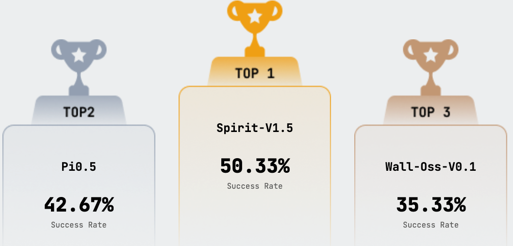

<div align="center">

# Spirit-v1.5 <br> <sub>A Robotic Foundation Model by Spirit AI</sub>

[](https://www.spirit-ai.com/en/blog/spirit-v1-5) &ensp; [](https://huggingface.co/Spirit-AI-robotics/Spirit-v1.5)
</div>


This repository contains the official implementation of the **Spirit-v1.5 VLA model**, as well as the runtime wrapper required to reproduce our results on the RoboChallenge benchmark. 

As of Jan 11, 2026, Spirit-v1.5 ranks **#1** on the [RoboChallenge](https://robochallenge.cn/home) Table30 benchmark.

## 📰 News
* **[2026-01]** Initial Release: Technical blog, inference code, base model checkpoint, and a fine-tuned checkpoint are now available.
* **[Coming Q1 2026]** We will release the fine-tuning code, instructions, and checkpoints for additional downstream tasks. Stay tuned!

## Directory Structure

```text
├── model/
│   ├── modeling_spirit_vla.py    # Main model architecture (Qwen3-VL backbone + DiT head + policy API)
│   └── utils.py                  # Shared helpers (normalization, sampling, preprocessing)
│
├── robochallenge/
│   ├── run_robochallenge.py      # Python entrypoint
│   ├── runner/
│   │   ├── executor.py           # RoboChallengeExecutor (Checkpoint loading, inference, I/O)
│   │   └── task_info.py          # Task metadata (robot type, action type, prompts, etc.)
│   ├── robot/                    # Derived from open-source RoboChallengeInference
│   │   ├── interface_client.py   # RoboChallenge HTTP client
│   │   └── job_worker.py         # Job polling loop and execution flow
│   └── utils/                    # Derived from open-source RoboChallengeInference
│       ├── enums.py              # Shared enums/constants
│       ├── log.py                # Logging helpers
│       └── util.py               # Misc utilities
│
└── scripts/
    └── run_robochallenge.sh      # Minimal runtime launcher
```

## Installation & Setup

System Requirements:
- Hardware: Tested on NVIDIA A100 80GB GPU.
- Software: Python 3.11+.

We recommend using `uv` for dependency management.
```bash
# Create and activate virtual environment
uv venv .venv
source .venv/bin/activate

# Install dependencies
uv pip install -r requirements.txt
```

## Model Checkpoints
| Model | Type | Link |
|----------|-------------|-------------|
| Spirit-v1.5 | Base Model | [](https://huggingface.co/Spirit-AI-robotics/Spirit-v1.5) |
| Spirit-v1.5-move-objects-into-box | Fine-tuned Model| [](https://huggingface.co/Spirit-AI-robotics/Spirit-v1.5-for-RoboChallenge-move-objects-into-box) |

## Run RoboChallenge
We provide a minimal launcher script located at `scripts/run_robochallenge.sh`.

### Environment Configuration
The script requires the following environment variables to be set. Note that `USED_CHUNK_SIZE` defaults to 60 if not specified; all other variables are mandatory.

| Variable | Description |
|----------|-------------|
| `TASK_NAME` | Must correspond to a task defined in `robochallenge/runner/task_info.py`. |
| `ROBOCHALLENGE_JOB_ID` | The unique ID for the job collection. |
| `USER_TOKEN` | Your authentication token. |
| `CKPT_PATH` | Directory containing the `model.safetensors` file. |
| `USED_CHUNK_SIZE` | Action chunk size (Default: 60). |

### Execution Example:

Below is an example for the RoboChallenge task `move_objects_into_box`.

```bash
cd /path/to/spirit_vla_repo

export TASK_NAME=move_objects_into_box
export ROBOCHALLENGE_JOB_ID=your_job_collection_id
export USER_TOKEN=your_user_token
# Download / reference checkpoint:
# https://huggingface.co/Spirit-AI-robotics/Spirit-v1.5-for-RoboChallenge-move-objects-into-box
export CKPT_PATH=/path/to/your_checkpoint_dir
export USED_CHUNK_SIZE=60

./scripts/run_robochallenge.sh
```

## Intended Uses

Spirit-v1.5 is a Vision-Language-Action (VLA) model designed specifically for robotic control. The model accepts current observations and textual descriptions as input and generates the next action chunk for the robot to execute.

## Out-of-scope Uses

Our models are not specifically designed for any tasks or scenarios other than robotic manipulations. 

Developers should expect failures in generation results regarding the out-of-scope scenarios. 

Developers should be aware of and adhere to applicable laws or regulations (including privacy, trade compliance laws, etc.) that are relevant to their use case, and evaluate and mitigate for privacy, safety, and fairness before using within a specific downstream use case, particularly for high-risk scenarios.

## Bibtex
```bibtex
@article{spiritai2026spiritv15,
  author = {Spirit AI Team},
  title = {Spirit-v1.5: Clean Data Is the Enemy of Great Robot Foundation Models},
  journal = {Spirit AI Blog},
  year = {2026},
  note = {https://www.spirit-ai.com/en/blog/spirit-v1-5},
}
```

## Acknowledgments
This codebase borrows code from [openpi](https://github.com/Physical-Intelligence/openpi), [qwen-vl](https://github.com/QwenLM/Qwen-VL) and [RoboChallengeInference](https://github.com/RoboChallenge/RoboChallengeInference). We thank them for their efforts and innovations, which have made the development process more efficient and convenient.

Thank you to everyone who contributed their wisdom and efforts to this project.

## Contact

We welcome feedback and collaboration from our audience. If you have suggestions, questions, or observe unexpected/offensive behavior in our technology, please contact us through `guojunliang@spirit-ai.com` and `miaotianrun@spirit-ai.com`.
